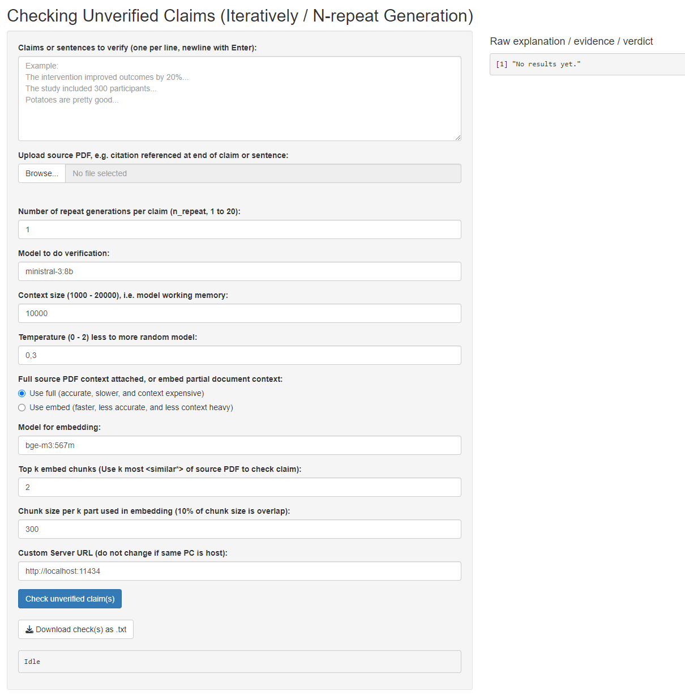

# checking_unverified_claims_iteratively_nrepeat_generation
Open source claim-to-reference "verification" tool using R, API (Ollama as is) and open weight LLMs. More automatically verify claims to the best of LLMs capability, given available text to verify and corresponding pdf of references.

I dare say the tool is a modernised "**ctrl+f**" in the age of artificial intelligence, although not yet so elegant, simple and universal.

**Warning**: LLMs are stochastic.

My experience is that this works well enough with 3b and 8b models to more quickly verify textual claims yourself.  Your experience may vary. 

The licence, Apache 2.0, is permissive to encourage use and improvements. 

If this program is, was, has been, or will be of interest to you in the near future in any way, I would appreciate to hear from you at: bakke.hindenes@proton.me 

## Requires:
- R (used 4.4.2)
- RStudio (https://posit.co/download/rstudio-desktop/) 
- R package: tidyllm (https://cran.r-project.org/web/packages/tidyllm/index.html), and more...
- Ollama (https://ollama.com/) or other API to LLM server

## Tested with:
- RTX 5070 12GB VRAM GPU (4-6s runtime per claim and source), 32GM RAM, Ryzen 3700X CPU, W11
- M4 SoC/APU, 16GB unified memory (around 60s per claim and source), macOS
- cogito:8b (https://ollama.com/library/cogito:8b); ministral-3:8b (https://ollama.com/library/ministral-3:8b); ministral-3:3b (https://ollama.com/library/ministral-3:3b); bge-m3:567m (https://ollama.com/library/bge-m3)
- The following paper: https://bmjleader.bmj.com/content/7/1/3 (due to last read and being both interesting and open source; right before making this program)

## The Shiny App:
A Shiny based App was (more or less) vibe coded using ChatGPT 5.1, Qwen2.5-coder:7b and Le Chat. It appears to work, and may be better for inexperienced users of R and RStudio. The "setup_run.R" is recommended to check before running the "app.R" if you have a fresh install of R, Rstudio and Ollama.

The Shiny based app now has a lot of options to choose from, and even supports (local but still) remote Ollama servers not running on your own PC.

## Cost savings, some naive calculations:
Suppose that the check of one claim in a text for a single source pdf takes about 10s. Suppose also that the total system power (RTX 5070 uses max 250W) can be approximately 400W. Then running the system of reference "verification" for an hour would then be about 0.4kWh, and ca. 360 claims can be checked in this period. If the kWh price of power is around 1 NOK, then 360 claims checked against a single source pdf costs only 0.4 NOK. Excluding the hardware (5-9k NOK https://www.prisjakt.no/search?query=rtx+5070) and setup time.

Comparably (maybe), a Norwegian scientist working exactly 37.5 hours a week (1950 hours a year), salaried at 650 000 NOK a year would cost 333.33 NOK per hour (average as of 2025). If a scientific publication must be fully read through (for the first, second or third time) to enable a sufficient manual claim check and the sufficient full reading of an often information dense publication takes at least 10 minutes, 20 minutes, 30 minutes, or an hour, then the cost savings per claim check can be as much as:

| Option        | Claims "verified" (per hour) | Cost (NOK per hour) | Cost per claim (NOK) | Times more expensive (rounded upward for rough clarity) |
|---------------|--------|------------------|--------------|--------------|
| LLM assisted reference "verification" tool   | 360    | 0.4    | 0.001 | Reference |
| Manual A      | 6      | 333.33 | 55.5  | 50 000  |
| Manual B      | 3      | 333.33 | 111.1 | 100 000 |
| Manual C      | 2      | 333,33 | 166.6 | 150 000 |
| Manual D      | 1      | 333.33 | 333.3 | 300 000 |

Now this is a theoretical speed-up assuming that there is no manual involvement even in the LLM assisted reference "verification" process. Still being assisted and enabled to "verify" a claim against 1-3 sources every 5 minutes would still result in an efficiency gain of up to 2-6 times more than the most optimistic(???) baseline outlined (6 claims per source per hour). If this can be shortened down to per every 1 minute, then a theoretical gain of up to 10-30 times may be more realistically expected for these types of workloads.

Correct me if some of the calculations are wrong.

## Inspiration(s) and motivation(s):
Inspired mainly by:
- **(1)** a true local story https://www.nrk.no/tromsogfinnmark/tromso-kommune-har-henvist-til-litteratur-som-ikke-finnes-i-omstruktureringen-av-skoler-1.17358938 which can arguably be avoided 100% in the future by using this tool. Another similar story https://retractionwatch.com/2025/12/19/world-bank-report-removed-nonexistent-references/ of non-existent references.
- **(2)** my previous work when reviewing the work of co-authors.

Other sources of motivation include:
- Wanting to have a **(1)** free, **(2)** offline, and **(3)** open source tool which is **(4)** able to run on modest and even dated consumer hardware in this economy with arguably acceptable performance.
- **(5)** Paid subscription services already exist.
- To promote **(6)** broad adoption in the Norwegian public sector (e.g. research, education, policy and administration), while also at the same time enabling **(7)** private companies, journalists, regulatory authorities, and curious individuals to more effortlessly double check the *supposed* scientifically based claims of public authorities, a free option is absolutely necessary.
- **(8)** The looming and seemingly inevitable enshittification of live subscription services. This offline tool changes only when you want and need it to if you have a copy / fork, **(9)** such that the program is suitable for work requiring reproducibility and documentation (i.e. research and public processes).
- **(10)** The inescapable issue with privacy regarding only-online services and sending data traffic across borders.

## Explaining the n-repeat option:
Since LLMs are stochastic this option is available for LLMs used that display more randomness in their "verification" process than others. One generation is in such cases simply not enough for a "proper verification", statistically speaking.

## Explaining the embedding option:
This program arguably work best with full context, but limits significantly the size of the documents to be checked. An embedding was therefore implemented (vibed) as a proof of concept, and although it yields a x2 speed-up on the M4 (around 30s instead of 60s), the failure rate increased markedly. Tread carefully with this one.

Also, the similarity function cosine was just chosen because it was suggested via vibe coding. Such that more thought can 100% be put into the selection of similarity functions... but not now for me and my own use case.

## Possible areas of improvement:
- Explore get_reply_data function, instead of simply get_reply function in tidyllm.
- Explore tidyllm ability to limit start and end page of pdf viewed,
- Explore tidyllm ability to use a prompt on every page of a pdf individually (20+ page academic books, rather than original research and shorter).
- Tokenize or chunk the input source (single pdf) to retrieve page number as part of evidence.
- Tokenize or chunk the input sources to use all sources (multiple pdfs) at the same time instead of one source per claim.
- Program to deconstruct pdf or text into a nested list structure used for iteratively checking unverified claims with corresponding sources at the end of the sentence. Specifically often the way writing happens in academic works or work based on scientific papers. This step is arguably best vibe coded per use case due to inherent document complexity.

## Final remark...
Don't mind the acronym... it is just another way to **"*interact with* the system"**.
